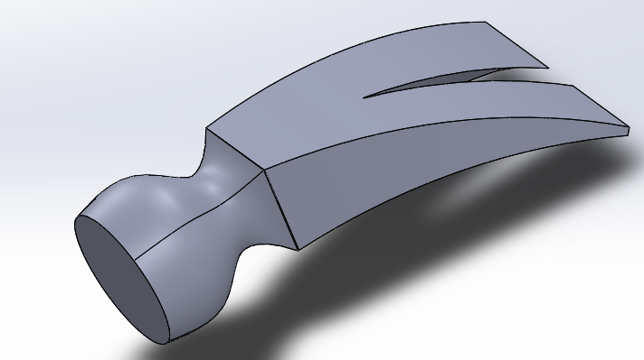
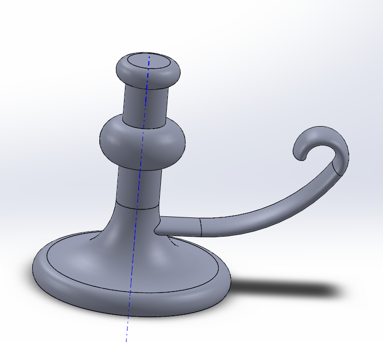

# NotSoBasicCad 

## Sweeps and Lofts 

### Description 
These assingments teach you more complex SolidWork tools 

### What I learned 
- I learned how to make multiple planes 
- I learned how to curve objects 

## Images

## Introduction

### Description 
These assingments are to refresh your memory on Solidworks and learn some new things. 

### What I learned
- I learned that SolidWorks has tutorials to taech you how to do things.
- I got better at SolidWorks

## Images 

